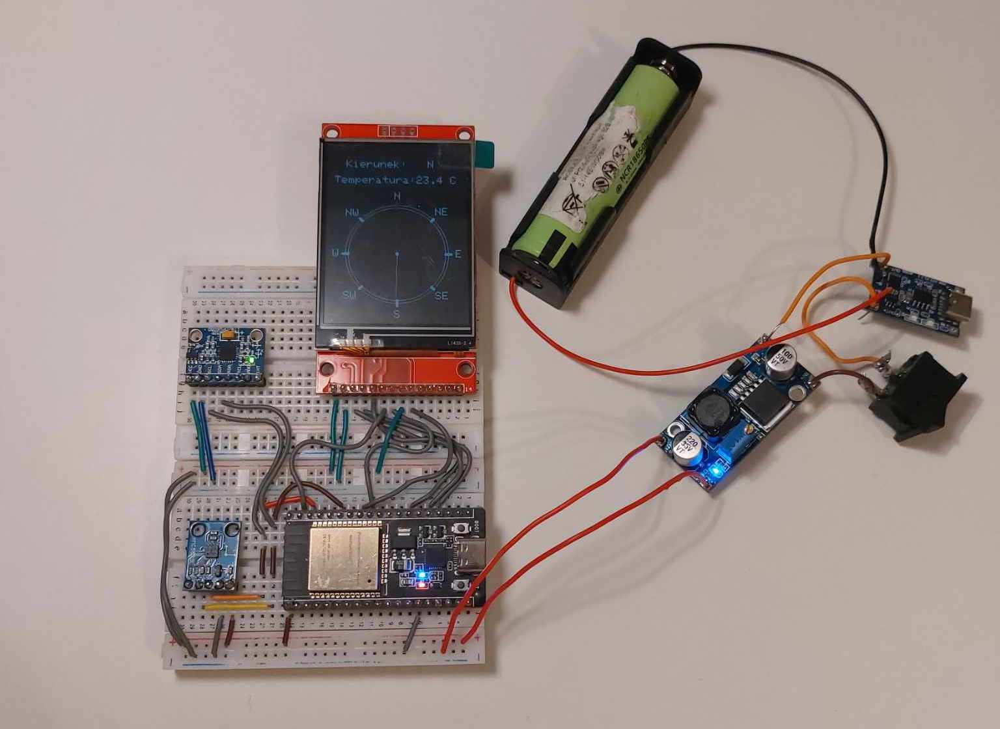

# ESP32 Electronic Compass with Graphical Display

A digital compass project developed for the **"Design Laboratory"** course at AGH UST. The device provides precise directional data using a magnetometer and accelerometer (for tilt compensation), visualizing the result on a TFT graphical display.

The project includes custom firmware for **ESP32**, calibration algorithms, and 3D-printable housing designs.


*Above: Breadboard prototype of the compass system.*

## Project Structure

The repository is organized as follows:

```text
esp32-electronic-compass/
│
├── firmware/                 # Arduino source code
│   ├── src/                  # Main application logic (Azimuth, Calibration, Smoothing)
│   └── tests/                # Unit tests for sensors (HMC5883L, MPU6050, Display)
│
├── hardware/                 # CAD files and 3D models
│   ├── 3d_models/            # STL files ready for 3D printing
│   └── cad_source/           # FreeCAD source project files (.FCStd)
│
├── docs/                     # Documentation and diagrams
└── img/                      # Project images
```

## Key Features

* **Sensor Fusion:** Combines data from HMC5883L (Magnetometer) and MPU6050 (Accelerometer).
* **Tilt Compensation:** Accurate bearing calculation even when the device is not perfectly level.
* **Graphical Interface:** Real-time visualization of the compass rose and heading on an ILI9341 TFT Display.
* **Calibration Mode:** Built-in routine to correct hard-iron and soft-iron magnetic interference.
* **Data Smoothing:** Implements moving average filtering for stable readings.
* **Custom Housing:** 3D printed enclosure designed in FreeCAD.

## Hardware Specifications

* **Microcontroller:** ESP32 DevKitC (Dual-core, WiFi/BT - though mainly used for processing power here).
* **Magnetometer:** HMC5883L / QMC5883L (3-Axis Magnetic Sensor).
* **Accelerometer/Gyro:** MPU6050 (6-Axis Motion Tracking).
* **Display:** 2.4" TFT LCD (240x320) with ILI9341 driver.
* **Power:** Li-Ion 18650 Battery + TP4056 Charger + DC-DC Step-Down Converter (3.3V).

## Software & Libraries

The firmware is developed using Arduino IDE.

Required Libraries:
* Adafruit_GFX (Graphics Core)
* Adafruit_ILI9341 (Display Driver)
* Adafruit_MPU6050 (Accelerometer)
* Adafruit_Sensor (Unified Sensor)
* HMC5883L (or QMC5883LCompass depending on the sensor variant)

## Setup & Installation

1. Clone the repository:

```Bash
git clone [https://github.com/BeneNat/esp32-electronic-compass.git](https://github.com/BeneNat/esp32-electronic-compass.git)
```
2. Open in Arduino IDE: Navigate to firmware/src/ and open main_code.ino. Note that all .ino files in the src folder should be opened together as a single project.

3. Install Libraries: Go to Sketch -> Include Library -> Manage Libraries and install the dependencies listed above.

4. Upload: Connect your ESP32 via USB and click Upload.

## Authors and Context

* **Authors:**
    * Filip Żurek
    * Jan Wycisk
* **Institution:** AGH University of Krakow
* **Faculty:** Faculty of Computer Science, Electronics and Telecommunications
* **Field of Study:** Electronics and Telecommunications
* **Course:** Design Laboratory

## License

This software is distributed under the MIT License. Refer to the [LICENSE](LICENSE) file for the full text.

---
*AGH University of Krakow - Design Laboratory 2025*
